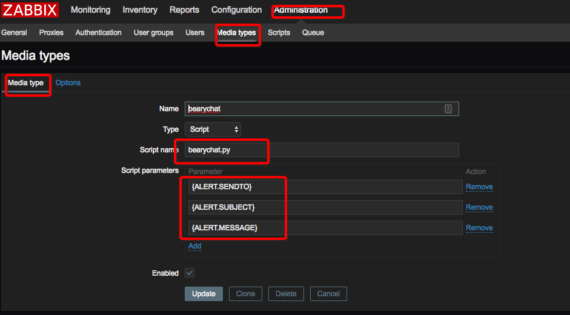
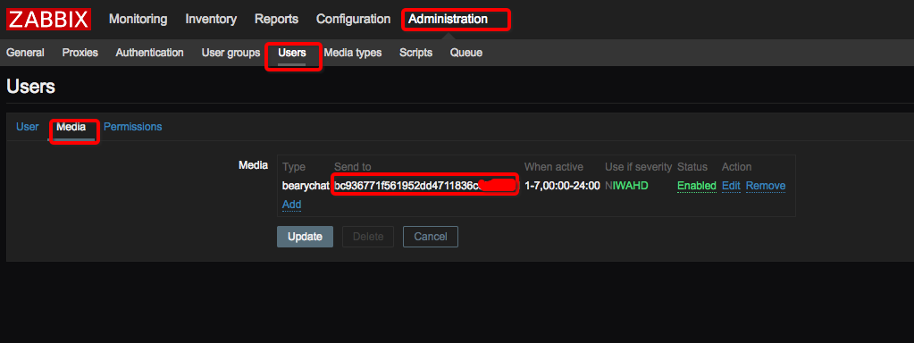
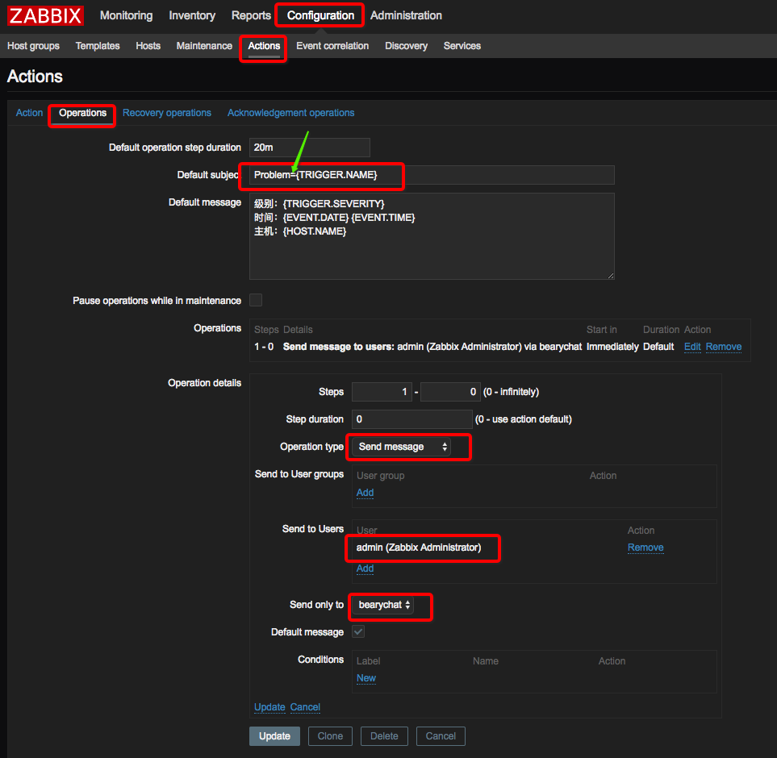
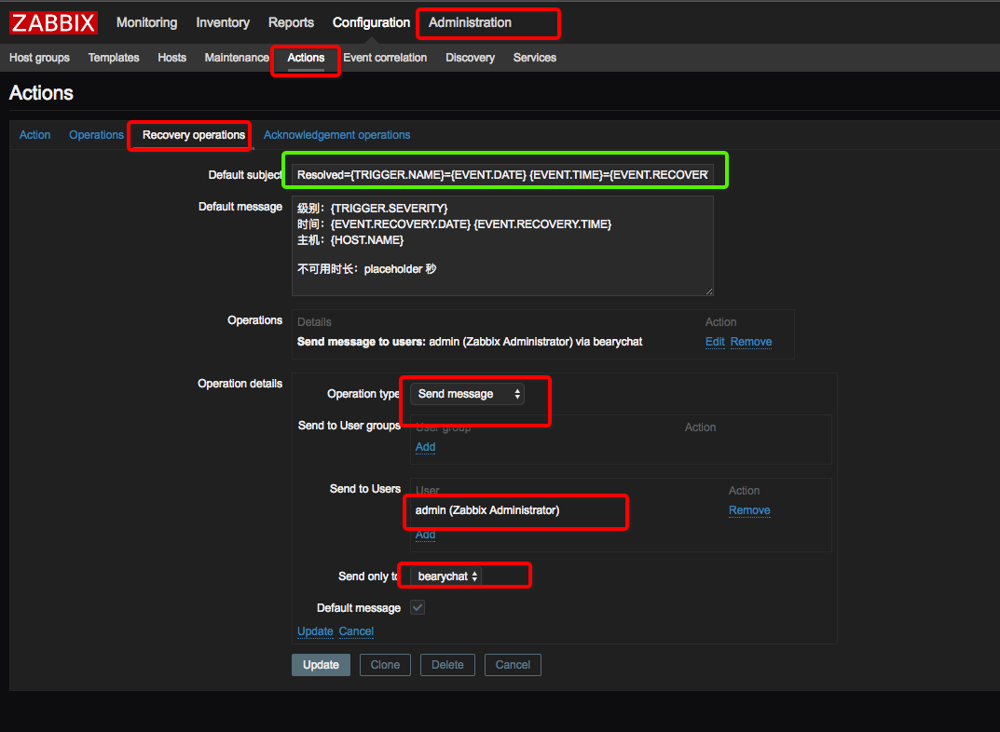
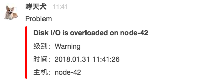
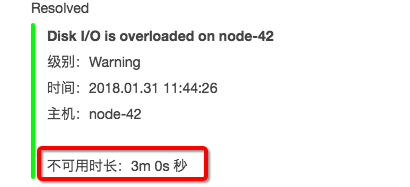

# zabbix报警发送到bearychat组

## 怎么配置
1. 复制zabbix_bearychat.py到zabbix_master服务的的目录：/usr/lib/zabbix/alertscripts/bearychat.py
2. ```
    chown zabbix:zabbix bearychat.py
    chmod u+x bearychat.py
   ```
3. 在bearychat控制台创建一个机器人，incoming类型的，这会获取到一个类似于token的字符串
4. 打开zabbix的dashboard
    - 配置media  
        Administration->Media type
        
        注意这里的script name必须要和第二步的名字保持一致
    - 配置用户  
        让用户与某个media关联  
        
        这里的sendto就是第三步申请的bearychat的ID
    - 配置故障报警  
        
        这里的等号不能少， 否则会导致bearychat.py解析异常
    - 配置故障恢复通知
        
        绿色框内的内容如下：  
        ```
        Resolved={TRIGGER.NAME}={EVENT.DATE} {EVENT.TIME}={EVENT.RECOVERY.DATE}     {EVENT.RECOVERY.TIME}
        ```
 
 5. 最后的结果： 
     - 报警截图  
     
     - 恢复截图  
     